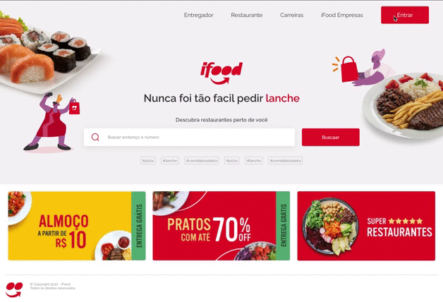

<h1 align="center">
  
 

## :bookmark: Sobre

Recriando a interface da página inicial do iFood.

## :rocket: Tecnologias Utilizadas

O projeto foi desenvolvido utilizando as seguintes tecnologias

- HTML
- CSS

## :heavy_check_mark: Resultado

[Exemplo online](https://epic-torvalds-a22ca1.netlify.app/)

<h4 align="center">
    
</h4>

<h4 align="center">
    Feito com 💜 by Deusdete Filho</a>
</h4>
